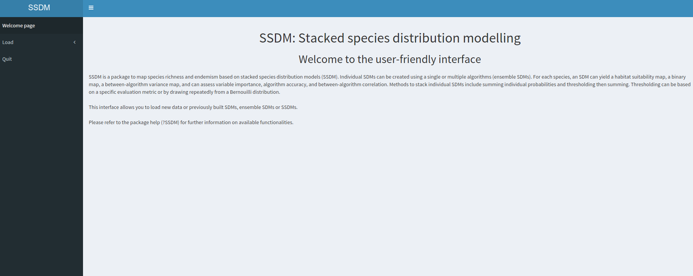
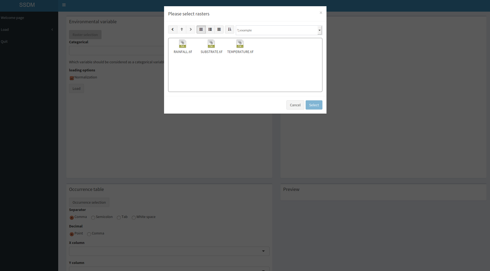
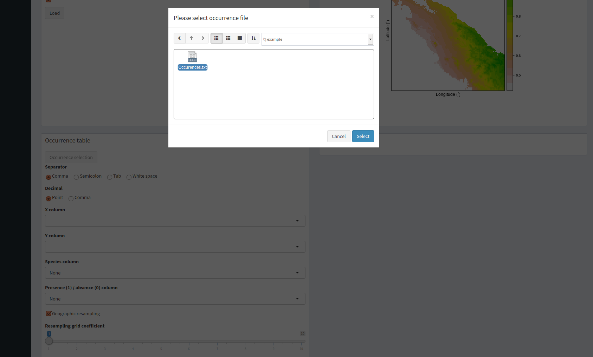
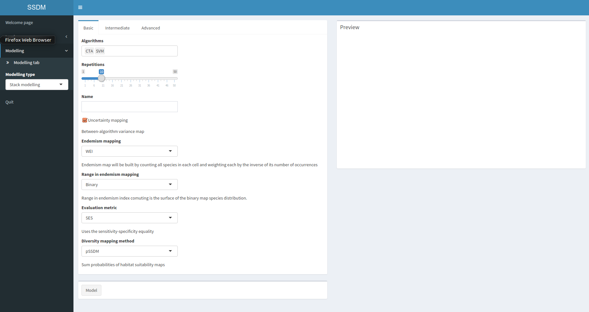
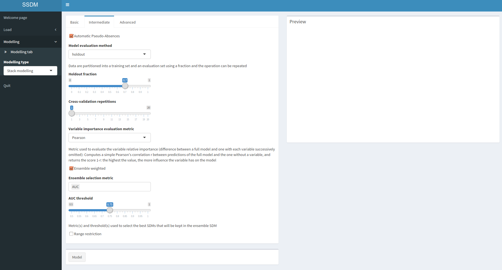
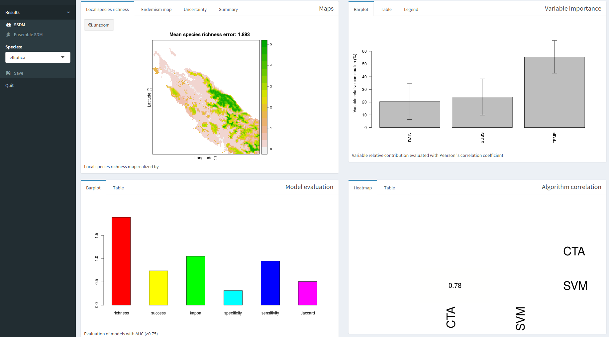
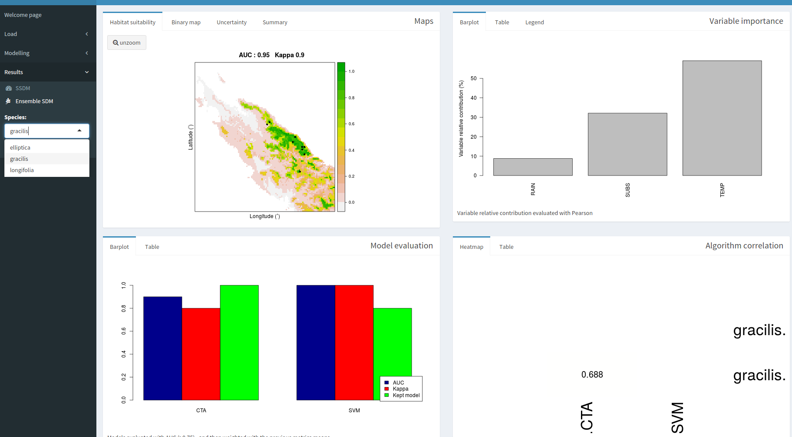
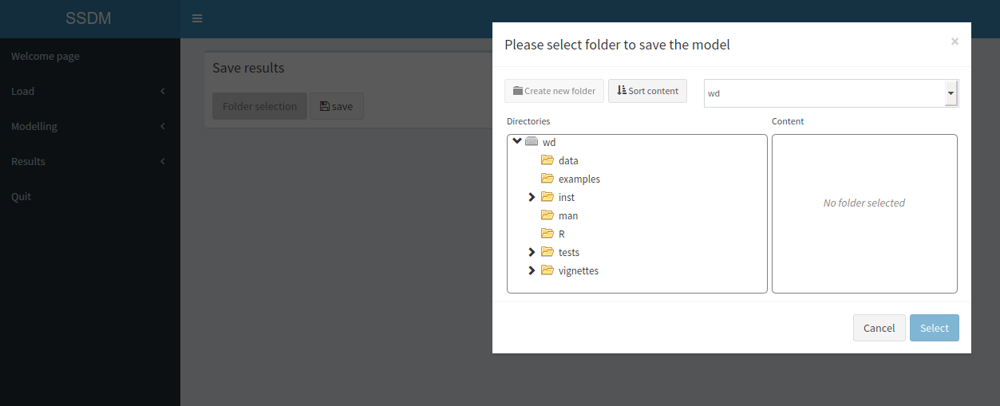

The package ‘SSDM’ offers a user-friendly interface built with the web application framework for R Shiny. The graphical user interface is launched with the function `gui`. 

{width=100%}

The interface has three tabs on the left, appearring successively: `Load` to load datasets or previous models and preview the data, `Modelling` to specify, train/test and save models, and `Results` to view the results and compare the performances. 

## Data inputs

The `Load` tab allows to load a new dataset or a previously saved model. **Pop-up windows for data selection contains a link toward example raw data in the drop down menu.** 

### Environmental variables

Top-left panel allows to load environmental variables through rasters. Don't forget to specify which variable should be considered as a categorical variable.

{width=100%}

### Natural history records

Second panel allows to load occurrences through csv or txt files. Don't forget to specify raw data formatting.

{width=100%}

## Model

The `Modelling` tab proposes three types of models: individual species distribution model (SDM), ensemble species distribution model (ESDM), or stacked species distribution model (SSDM). The `Modelling` tab contains three sub-tabs offering different levels of parameterization according to the user’s level of expertise: (1) `Basic` to select the model algorithm(s), the number of runs per model algorithm, the model evaluation metric(s), and the methods to be used to map diversity and endemism; (2) `Intermediate` to set pseudo-absence selection (number and strategy), the cross-validation method, the metric used to estimate the relative contribution of environmental variables, the ESDM consensus method, and the SSDM stacking method; and (3) `Advanced` to set algorithm parameters. 

### Basic parameterization

{width=100%}

### Intermediate parameterization

{width=100%}

### Advanced parameterization

{width=100%}

## Results

The `Results` tab gives maps and graphs summurizing the results at stack and species levels: model maps (species habitat suitability, species richness and endemism), relative contribution of environmental variables, model accuracy assessment, and between-algorithms correlation. 

#### Stack-level results

{width=100%}

#### Species-level results

{width=100%}

## Save

The interface includes a panel to save result maps in GeoTIFF format (.tif) compatible with most GIS softwares, and other numerical results as comma separated values (.csv) files.

{width=100%}
