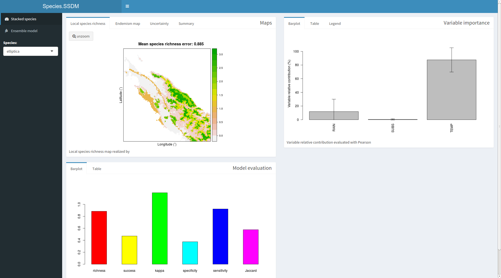

The package ‘SSDM’ is a computer platform implemented in R providing a range of methodological approaches and parameterization at each step of the SSDM building. This vignette presents a typical workflow in R command to use it. An additionnal vignette presents the same workflow using the graphic user interface with `gui` function (see [GUI](GUI.html) vignette).

The workflow of the package ‘SSDM’ is based on three modelling levels: 

1. the individual Species Distribution Model (SDM) fitting the occurrences of a **single species** on environmental predictor variables with a **single modelling algorithm**,
2. the ensemble SDM (ESDM) combining the outputs of several SDMs, **each SDM using a different modelling algorithm**,
3. the stack SDM combining several SDM or ESDM outputs to model **species assemblages** and compute **species diversity and species richness** (Fig. 1).

{width=100%}

## Data inputs

### Environmental variables

In addition to build species distribution models you will need environmental variables. Currently ‘SSDM’ uses all raster formats supported by the R package ‘rgdal’. The package ‘SSDM’ supports both continuous (e.g., climate maps, digital elevation models, bathymetric maps) and categorical environmental variables (e.g., land cover maps, soil type maps) as inputs. The package also allows normalizing environmental variables, which may be useful to improve the fit of certain algorithms (like artificial neural networks).

Rasters of environmental data need to have the same coordinate reference system while spatial extent and resolution of the environmental layers can differ. During processing, the package will deal with between-variables discrepancies in spatial extent and resolution by rescaling all environmental rasters to the smallest common spatial extent then upscaling them to the coarsest resolution.

‘SSDM’ include `load_var` function to read raster files including your environmental variables. We will work with three 30 arcsec-resolution rasters covering the north part of the main island of New Caledonia ’Grande Terre’. Climatic variables (RAINFALL and TEMPERATURE) are from the WorldClim database, and the SUBSTRATE map is from the IRD Atlas of New Caledonia (2012) (see `?Env`).  

```{r Environmental variables}
library(SSDM)
Env <- load_var(system.file('extdata',  package = 'SSDM'), categorical = 'SUBSTRATE', verbose = FALSE)
Env
```

**Note that:**

  - Specify which environmental variable is categorical with `categorical` parameter. 
  - Normalization is activated by default, check `Norm` option.
  
### Natural history records

Species distribution models are built on natural history records. 

‘SSDM’ include `load_occ` function to read raw csv or txt files including your natural history records. We will work with natural history records from five Cryptocarya species native to New Caledonia (see `?Occurrences`).  

```{r Natural history records}
Occ <- load_occ(path = system.file('extdata',  package = 'SSDM'), Env,
         Xcol = 'LONGITUDE', Ycol = 'LATITUDE',
         file = 'Occurrences.csv', sep = ',', verbose = FALSE)
head(Occ)
```

**Note that:** 

  - Occurences are checked after environmental data are loaded, therefore environmental data need to be loaded before occurrences. 
  - Use `GeoRes` option to thin occurences. Thinning removes unnecessary records, reducing the effect of sampling bias while retaining the greatest amount of information.
  - For issues opening file look at additional options of `read.csv` function used to open you raw data.*


## Model algorithms

### Individual species distribution models (SDMs)

In the example below we build an *elliptica* distribution model with a subset the occurrences of the species and specifying a single algorithm, here generalized linear models. The package ‘SSDM’ includes the main algorithms used to model species distributions: general additive models (GAM), generalized linear models (GLM), multivariate adaptive regression splines (MARS), classification tree analysis (CTA), generalized boosted models (GBM), maximum entropy (Maxent), artificial neural networks (ANN), random forests (RF), and support vector machines (SVM). Default parameters of the dependent R package of each algorithm were conserved but most of them remain settable.

```{r SDM}
SDM <- modelling('GLM', subset(Occurrences, Occurrences$SPECIES == 'elliptica'), 
                 Env, Xcol = 'LONGITUDE', Ycol = 'LATITUDE', verbose = FALSE)
plot(SDM@projection, main = 'SDM\nfor Cryptocarya elliptica\nwith GLM algorithm')
```

**Note that:** The package ‘SSDM’ encompass a large methodolgy offered by litterature. Have a look at all parameters for `modelling` function with `?modelling`.

### Ensemble species distribution models (ESDMs)

In this other example we build an ensemble *elliptica* distribution model combining CTA and MARS based SDMs of this species. Because uncertainty in distribution projections can skew policy making and planning, a recommendation is to fit a number of alternative model algorithms and to explore the range of projections across the different SDMs and then to find consensus in SDM projections. Two consensus methods are implemented in the package ‘SSDM’: 

1. a simple average of the SDM outputs
2. a weighted average (default option, used below), with weigths based on a user-specified metric or group of metrics. 

The package also provides an uncertainty map representing the between-algorithms variance. The degree of agreement between each pair of algorithms can be assessed through a correlation matrix giving the Pearson's coefficient.


```{r ESDM}
ESDM <- ensemble_modelling(c('CTA', 'MARS'), subset(Occurrences, Occurrences$SPECIES == 'elliptica'),
                           Env, rep = 1, Xcol = 'LONGITUDE', Ycol = 'LATITUDE',
                          ensemble.thresh = 0, verbose = FALSE)
plot(ESDM@projection, main = 'ESDM\nfor Cryptocarya elliptica\nwith CTA and MARS algorithms')
```

**Note that:** the package ‘SSDM’ includes a large methodology offered by litterature. Have a look at all parameters for `ensemble_modelling` function with `?ensemble_modelling`.

### Stacked species distribution models (SSDMs)

Finally, we build a stacked species distribution model using CTA and SVM algorihtms and multiple species. The outputs of the differnt species are aggregated in SSDM maps of local species richness and composition using summing continuous habitat suitability maps stacking method (pSSDM).


```{r SSDM}
SSDM <- stack_modelling(c('CTA', 'SVM'), Occurrences, Env, rep = 1, ensemble.thresh = 0,
                       Xcol = 'LONGITUDE', Ycol = 'LATITUDE',
                       Spcol = 'SPECIES', method = "pSSDM", verbose = FALSE)
plot(SSDM@diversity.map, main = 'SSDM\nfor Cryptocarya genus\nwith CTA and SVM algorithms')
```

Five other stacking methods are available (see references in `?stack_modelling` for details): 

  - by summing discrete presence/absence maps (bSSDM) derived from one of the six metrics available to compute binary maps
  - by summing discrete presence/absence maps obtained by drawing repeatedly from a Bernoulli distribution 
  - by applying the ‘probability ranking’ rule (PRR) of the SESAM framework (a number of species equal to the prediction of species richness is selected on the basis of decreasing probability of presence calculated by the SDMs) with species richness as estimated by a pSSDM (referred to as ‘PRR.pSSDM’)
  - by applying the PRR with species richness as estimated by a MEM (‘PRR.MEM’)
  - by using the maximum-likelihood adjustment approach

## Outputs

### Model accuracy assessment

A range of model evaluation metrics included in package ‘SDMTools’ have been integrated in the package ‘SSDM’. They include the area under the receiving operating characteristic (ROC) curve (AUC), the Cohen's Kappa coefficient, the omission rate, the sensitivity (true positive rate) and the specificity (true negative rate). These metrics are all based on the confusion matrix (also called ‘error matrix’, which represents the instances in a predicted class versus the instances in an actual class). The confusion matrix is computed converting the habitat suitability maps into binary presence/absence maps.

```{r SDM evaluation}
knitr::kable(ESDM@evaluation)
```

To assess the accuracy of an SSDM, the package provides the opportunity to compare modeled species assemblages with species pools from independent inventories observed in the field. Six evaluation metrics are computed: (1) the species richness error, i.e. the difference between the predicted and observed species richness; (2) assemblage prediction success, i.e. the proportion of correct predictions; (3) assemblage Cohen’s kappa, i.e. the proportion of specific agreement; (4) assemblage specificity, i.e. the proportion of true negatives (species that are both predicted and observed as being absent); (5) assemblage sensitivity, i.e. the proportion of true positives (species that are both predicted and observed as present); and (6) the Jaccard index, a widely used metric of community similarity.

```{r SSDM evaluation}
knitr::kable(SSDM@evaluation)
```

### Importance analysis of environmental variables

The package ‘SSDM’ provides two methods to measure the relative contribution of environmental variables, which quantifies the relevance of an environmental variable to determine species distribution. The first method is based on a jack knife approach that evaluates the change in accuracy between a full model and the models where each environmental variable are omitted in turns. All metrics available in the package can serve to assess the change in accuracy. The second method is based on the Pearson's correlation coefficient between a full model and the models where each environmental variable are omitted in turns.

```{r SSDM variable importance}
knitr::kable(SSDM@variable.importance)
```

### Endemism mapping

In addition to species richness, endemism is an important feature for conservation as it refers to species being unique to the defined geographic location. Species endemism maps can be computed using two metrics: 

1. the weighted endemism index (WEI)
2. the corrected weighted endemism index

```{r SSDM endemism}
plot(SSDM@endemism.map, main = 'Endemism map\nfor Cryptocarya genus\nwith CTA and SVM algorithms')
```

### Summary plot

All results can be sumarized inside a shiny dashboard by calling `plot` method directly on an SSDM object.

```{r plot}
# plot(SSDM)
```

{width=100%}
